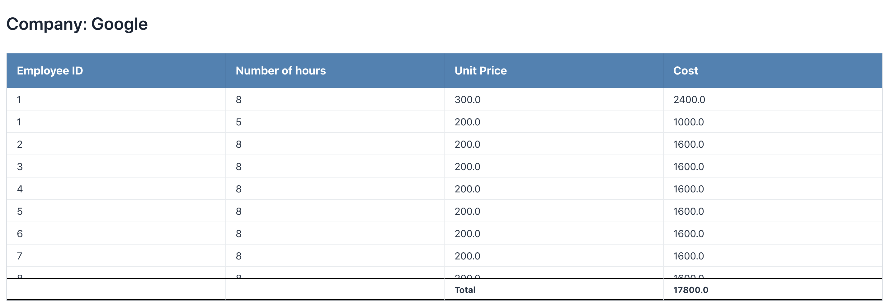

# Billable Hours
Billable hours is a web application developed with Vaadin and Spring Boot that accepts a timesheet (in csv format) as
 input and automatically generates invoices for each company 

## Input Format
| Employee ID 	| Billable Rate (per hour) 	| Project  	| Date       	| Start Time 	| End Time 	|
|-------------	|--------------------------	|----------	|------------	|------------	|----------	|
| 1           	| 300                      	| Google   	| 2019-07-01 	| 09:00      	| 17:00    	|
| 2           	| 100                      	| Facebook 	| 2019-07-01 	| 11:00      	| 16:00    	|

## Generated Invoice

## Building
1. Clone repository and switch to it's directory.
2. Run `mvn spring-boot:run` or `./mnvnw spring-boot:run`add the `-P=production-mode` to run in production mode or run
 with Docker `docker build -t billable-hours:v0.0.1 . && docker run -d billable-hours:v0.0.1`
3. run `mvn clean package`
 - You could also run the jar file directly if you are running jdk8 above `cd target` then `java -jar billable-hours-0.0.1-SNAPSHOT.jar`
    
 > App would be available on `http://{localhost}:{port}` and API doc `http://{localhost}:{port}/swagger-ui.html`

 

## How to contribute
I'm more than welcome to contributions, If you are willing to contribute to the project feel free to make a fork and submit a pull request. You can hit me up on [@IEnoobong](https://twitter.com/IEnoobong)
